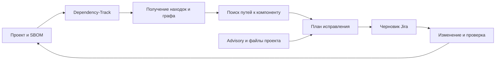

# От находки SCA к задаче на исправление

Система превращает сообщение об уязвимой зависимости в понятную задачу разработчику: **что обнаружено, через какой пакет пришло, какое изменение предлагается и чем подтверждается исправление**.

Например, отчёт указывает `@babel/traverse`, а разработчик управляет зависимостью `@babel/core`. Система восстанавливает путь между ними и отдельно ищет основание для выбора версии обновления.

Репозиторий содержит **проверенный прототип на одном npm-кейсе**, локальный Dependency-Track, ответы API и черновик Jira. Универсальный подбор обновлений и отправка задач в Jira пока не реализованы.

## Поток обработки



Граф показывает существующие зависимости. Версия исправления определяется отдельно по advisory, ограничениям проекта и проверке обновления. Последняя доступная версия не равнозначна доказанному исправлению.

## Компоненты

| Компонент | Ответственность | Реализация сейчас |
|---|---|---|
| Подготовка SBOM | Зафиксировать компоненты, версии и связи | npm fixtures, CycloneDX npm CLI |
| Dependency-Track | Хранить состав и находить уязвимости | API/frontend 4.13.0, OSV npm |
| Клиент API | Получать находки и зависимости | experiment.py, inspect_api.py |
| Анализ графа | Найти пути и прямые зависимости | collect_graph.py; цель пока задана PURL Babel |
| План исправления | Обосновать действие и версию | Правило одного advisory в generate_jira.py |
| Формирование задачи | Текст, доказательства и критерии приёмки | Markdown/JSON, без отправки в Jira |
| Проверка результата | Сравнить состав и находки после изменения | fixture-fixed, verify_fixed.py |
| Доказательства | Сохранить входы и результаты | evidence/ |

Это логические компоненты. В прототипе несколько обязанностей объединены в скриптах; предлагаемые границы модулей описаны в архитектуре.

## Документация

- [Идея системы и сценарий использования](docs/system-concept.md).
- [Архитектура: компоненты, контракты и развитие](docs/architecture.md).
- [Пошаговый гайд по API](dependency-track-api-guide.md).
- [Стенд и результаты эксперимента](docs/experiment.md).
- [Пример задачи Jira](jira-draft.md).

## Проверенный результат

1. SBOM с 43 компонентами загружен в Dependency-Track.
2. Найдены три пути к traverse@7.23.0, все через core@7.23.0.
3. Обнаружена GHSA-67hx-6x53-jw92 с алиасом CVE-2023-45133.
4. Рекомендация версии core извлечена из текста advisory, возвращённого API.
5. После удаления тестового override и обновления зависимости целевая находка исчезла. Другая уязвимость core осталась.

Эксперимент подтверждает возможность собрать доказательства для задачи. Универсальность подбора исправлений, эксплуатация CVE и совместимость с реальным приложением не проверялись.

## Структура репозитория

```text
 docs/                          Идея, архитектура, эксперимент
 dependency-track-api-guide.md  Подробный алгоритм API
 compose.yaml                   Локальный Dependency-Track
 fixture/                       Исходный npm-кейс
 fixture-fixed/                 Исправление целевой CVE
 bom.json, bom-fixed.json        Состав до и после
 *.py                           Скрипты прототипа
 evidence/                      Ответы API и логи
 jira-draft.md, jira-draft.json  Результат формирования задачи
```

## Локальный стенд

```powershell
docker compose up -d
```

UI: <http://localhost:19091>. API: <http://127.0.0.1:19090/api>.

На настроенном стенде логин admin, случайный пароль находится в локальном .secrets.json, исключённом из Git. В новом checkout файла нет. Скрипты ориентированы на подготовленный стенд; это пока не единая команда установки продукта. Порядок запуска описан в [эксперименте](docs/experiment.md).
