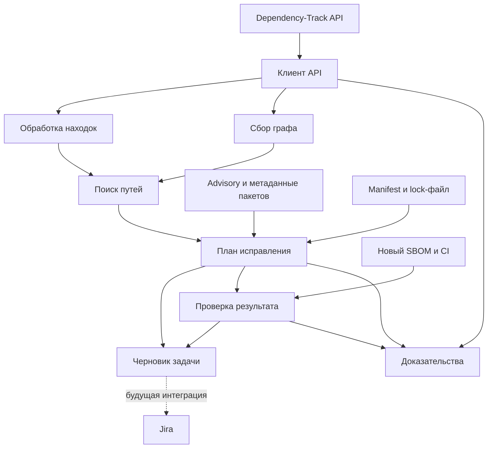

# Архитектура системы

## Статус

Документ описывает целевую логическую архитектуру и её соответствие прототипу. Контракты и названия будущих модулей — предложение, не уже реализованный API. Компоненты можно разместить в одном приложении; отдельные микросервисы не требуются.

## Компоненты и ответственность

| Компонент | Вход | Выход | Ответственность | Реализация сейчас |
|---|---|---|---|---|
| Управление запуском | Проект, версия, параметры | Статус запуска | Готовность анализа, последовательность этапов, снимок | Ручной запуск скриптов |
| Клиент Dependency-Track | Адрес, авторизация, UUID | Ответы API | HTTP, ошибки, таймауты, пагинация где требуется | req() в experiment.py |
| Обработка находок | Находки проекта | Целевые UUID и advisory | Алиасы, аудит и подавление; разные компоненты не смешиваются | Выбор одной GHSA в generate_jira.py |
| Сбор графа | UUID проекта | Узлы и рёбра | Обход корня, одно чтение узла, сохранение всех рёбер | collect_graph.py |
| Поиск путей | Граф, целевой UUID | Пути и прямые зависимости | Поиск без предположений о родителе, защита от циклов | Там же, цель пока выбрана по PURL |
| Анализ рекомендаций | Advisory, метаданные пакетов | Обоснованные варианты | Каждая версия связана с источником | Правило одного advisory Babel |
| План исправления | Пути, варианты, manifest | Действия и неизвестные условия | Overrides, несколько родителей, ограничения совместимости | Частично generate_jira.py |
| Формирование задачи | Находка, пути, план | Markdown/JSON | Факты, действия, ограничения, приёмка | Реализовано для примера |
| Доставка в Jira | Черновик и ключ дедупликации | Issue key, статус | Создание/обновление и повторные попытки | Не реализована |
| Проверка результата | Новый состав, анализ, CI | Результат по целевой CVE | Все копии, состояние анализа, сборка и тесты | verify_fixed.py проверяет только тестовый состав и находки |
| Доказательства | Ответы и выводы | Артефакты запуска | Время, версия проекта, происхождение данных, исключение секретов | evidence/, без единого manifest запуска |

## Поток данных



## Контракты между компонентами

Предлагаемая модель данных для общего сервиса:

| Сущность | Основные поля | Правило |
|---|---|---|
| AnalysisRun | runId, projectUuid, projectVersion, capturedAt, bomHash, analysisStatus | Ответы должны относиться к одному состоянию проекта |
| Finding | componentUuid, vulnerabilityUuid, source, vulnId, aliases, auditState | Связь с графом по UUID |
| DependencyGraph | rootUuid, nodes, edges, coverage, errors | Ошибка чтения не становится пустым списком зависимостей |
| DependencyPaths | targetUuid, paths, directDependencyUuids, truncated | Ограничение числа путей явно отражается |
| RemediationPlan | actions, evidenceRefs, constraints, unresolved, status | Версия имеет источник; неизвестные данные сохраняются |
| TaskDraft | summary, description, findingRefs, acceptanceCriteria | Содержание отделено от формата REST API Jira |
| Verification | beforeRun, afterRun, inventoryResult, analysisResult, ciResult | Пустой отчёт при сбое источника не означает исправление |

Пример проектируемого плана, а не текущий формат генератора:

```json
{
  "status": "candidate",
  "targetComponent": "@babel/traverse@7.23.0",
  "directDependency": "@babel/core@7.23.0",
  "actions": [
    { "type": "remove_override", "package": "@babel/traverse" },
    { "type": "upgrade", "package": "@babel/core", "minimumVersion": "7.23.2" },
    { "type": "refresh_lockfile" }
  ],
  "evidenceRefs": ["paths.json", "findings.json:vulnerability.description", "package.json:overrides"],
  "unresolved": ["Совместимость реального приложения требует проверки"]
}
```

Версия в примере — исторический минимум для одной CVE, а не общая рекомендация актуальной версии Babel.

## API и вычисления

1. GET /api/v1/finding/project/{projectUuid} — UUID уязвимых компонентов.
2. GET /api/v1/dependencyGraph/project/{projectUuid}/directDependencies — корневые зависимости.
3. GET /api/v1/dependencyGraph/component/{componentUuid}/directDependencies — обход компонентов.
4. Локальный поиск путей к целевым UUID и выделение первых узлов после проекта.
5. Один снимок графа повторно используется для всех находок проекта.

API проверено на 4.13.0. Граф с сервисами требует отдельной обработки; текущий прототип обходит пакеты. Детали — в [гайде](../dependency-track-api-guide.md).

## Состояния и неполнота

Состояния этапов независимы:

- Граф: complete, partial, unavailable. Complete означает полное чтение доступного графа, а не доказанную полноту SBOM.
- План: needs_review, candidate, verified. Verified требует определённых проверок и их результатов.
- Задача: draft, published, delivery_failed.
- Проверка: not_run, passed, failed, inconclusive; состав, анализ и CI оцениваются отдельно.

При отсутствующем пути или рекомендации формируется задача на исследование с пометкой «Требует уточнения». Родитель и версия не угадываются. Изменение SBOM во время обхода требует нового снимка либо фиксации неполноты.

## Жизненный цикл Jira

Будущая интеграция хранит ключ: система-источник, проект и версия, целевой компонент, группа алиасов advisory. Перед созданием задачи проверяется существующая запись. Повторная доставка использует тот же ключ.

UUID удобен внутри снимка; между версиями проекта дополнительно нужны PURL и правила сопоставления. Несколько путей к одному компоненту дополняют одну находку. Объединение разных находок в одну задачу обновления — отдельная политика.

Закрытие задачи требует проверенного устранения. Подавление находки, удаление компонента из неполного SBOM или сбой базы уязвимостей сами по себе таким доказательством не являются.

## Предлагаемые модули

Текущие файлы оставлены на прежних местах для воспроизводимости. При реализации общего сервиса границы можно оформить так:

```text
src/
  dependency_track_client.py  HTTP и контракты API
  findings.py                Находки и алиасы
  dependency_graph.py        Сбор узлов и рёбер
  dependency_paths.py        Пути и прямые зависимости
  remediation.py             План и источники рекомендаций
  task_builder.py            Черновик
  jira_client.py             Доставка и дедупликация
  verification.py            Проверка исправления
  evidence_store.py          Снимки и происхождение данных
  runner.py                  Управление запуском
```

## Порядок развития

1. Убрать привязку к Babel: принимать целевой UUID из находки, параметры проекта и advisory.
2. Ввести единый запуск, стабильный снимок и явную неполноту этапов.
3. Добавить источники рекомендаций и проверку разрешённых версий менеджером пакетов.
4. Подключить результаты CI и проверку всех затронутых копий.
5. Реализовать доставку в Jira, дедупликацию и жизненный цикл задач.

Проверочные сценарии: несколько родителей, отсутствующий граф, циклы, недоступный API, отсутствующая рекомендация, ограничение числа путей, неуспешное обновление, повторная доставка.
